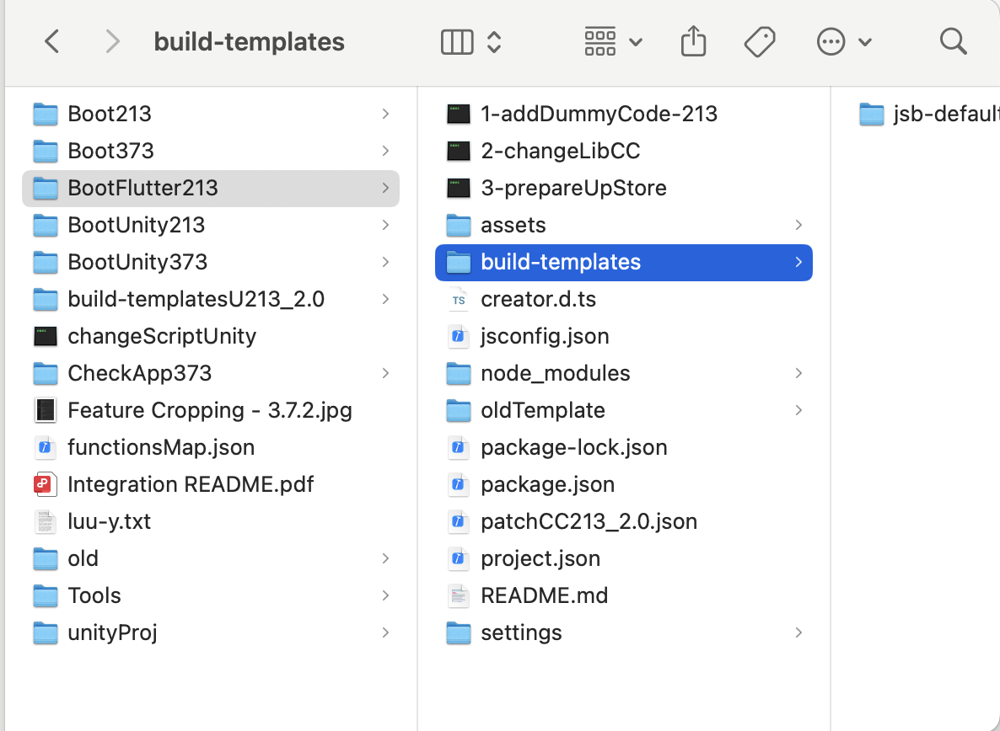
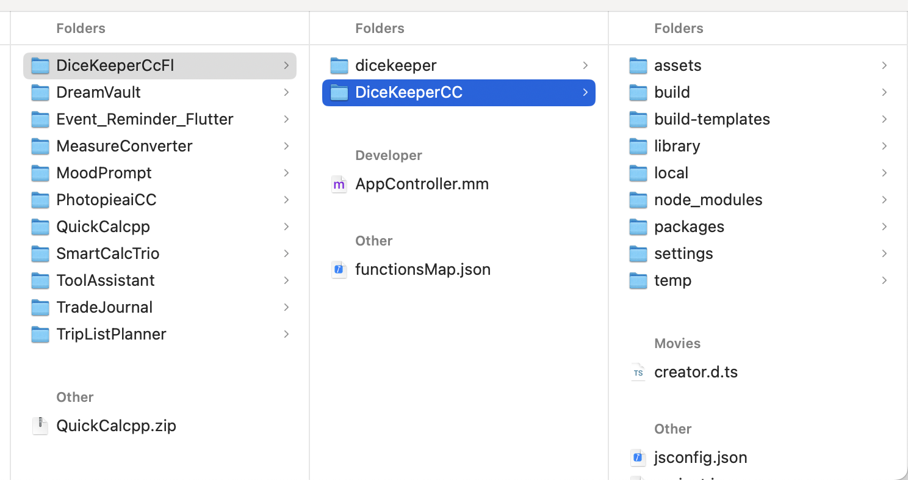

# Flutter + Cocos2d-x Integration Guide (iOS)

This guide walks you through integrating a **Flutter application** with a **Cocos2d-x (v2.1.3) iOS game**, allowing you to launch the Flutter UI first, and transition to Cocos2d-x game logic from Flutter.

---

## ✅ Prerequisites

- macOS with Xcode installed (latest version recommended)
- Homebrew installed

---

## 1. Install Flutter by running below command 

```bash
brew install --cask flutter
```


Add Flutter to your shell environment:

```bash
echo 'export PATH="$PATH:`flutter doctor --android-licenses`"' >> ~/.zshrc
source ~/.zshrc
```

Verify Flutter is installed:

```bash
flutter doctor
```


---

## 2. Install Cocos2d-x

Install Cocos 2.1.3 [you can use custom engine]

---

## 3. Create Flutter Application and Build for iOS

Create Flutter app:
Open the terminal at where you want to create the project and run below command

```bash
flutter create flutter_app
cd flutter_app
```

here `flutter_app` is the project name, you can choose your own project name

Update `main.dart` to include a button that triggers native call:

`main.dart` will be located at `flutter_app/lib/main.dart`

```dart
import 'package:flutter/material.dart';
import 'package:flutter/services.dart';

class MyHomePage extends StatelessWidget {
  static const platform = MethodChannel('cocos_bridge');

  void launchCocosGame() async {
    try {
      await platform.invokeMethod('launchCocos');
    } catch (e) {
      print('❌ Failed to launch Cocos: \$e');
    }
  }

  @override
  Widget build(BuildContext context) {
    return Scaffold(
      appBar: AppBar(title: Text("Flutter UI")),
      body: Center(
        child: ElevatedButton(
          onPressed: launchCocosGame,
          child: Text("Launch Cocos Game"),
        ),
      ),
    );
  }
}

void main() => runApp(MaterialApp(home: MyHomePage()));
```

This Flutter code creates a simple UI with a button labeled "Launch Cocos Game."
When the button is tapped, it sends a message over a platform channel (cocos_bridge) to the native iOS code using MethodChannel.


Then build for iOS:
```bash
flutter build ios 
```

Navigate to:
```
flutter_app/build/ios/Release-iphoneos/
```
Locate `App.framework` and `Flutter.framework`.

---

## 4. Add 2.1.3 SDK files

This steps are Similar to pure cocos SDK integration. Files have to copy from 'BootFlutter213'.

1. First run '3-prepareUpStore' tool before copying the files
2. Copy 'LoadScene' and 'Ext' folders from assets folder, to your cocos project assets folder
3. Copy 'node_modules' to your cocos root folder -- if 'node_modules' not found then you have to run `npm install` at 'BootFlutter213' folder
4. Copy build-templates folder from UPStoreTools/BootFlutter213/ and paste to you Cocos root folder
From

To


---
## 5. Build Cocos2d-x Game for iOS

Navigate to your project and locate `cc_proj_for_flutter.xcodeproj` file
```bash
/cc_proj_for_flutter/build/jsb-default/frameworks/runtime-src/proj.ios_mac/
```
Open `cc_proj_for_flutter.xcodeproj` and ensure it builds successfully for a simulator or device.

---

## 6. Create Workspace and Add Both Projects

1. Open Xcode
2. Create new workspace 
Goto File->New->Workspace, give a name for the file eg: `FlutterCocosLauncher.xcworkspace`

3. Drag the following projects into the workspace:
   - `flutter_app/ios/Runner.xcodeproj`
   - `cc_proj_for_flutter/build/jsb-default/frameworks/runtime-src/proj.ios_mac/cc_proj_for_flutter.xcodeproj`

---

## 7. Add Frameworks to Cocos Project

1. Select `cc_proj_for_flutter` in xcode,make sure TARGETS selected as `cc_proj_for_flutter-mobile` 
2. Select `General` tab, Expand `Frameworks, Libraries, and Embedded Contents` 
3. Press `+` Symbol


4. Click on Dropdown Option `Add Other..` then select `Add Files`


5. Navigate to `flutter_app/build/ios/Release-iphoneos/` and select both `App.framework` and `Flutter.framework`. Then click Open


6. Make sure to mark `App.framework` and `Flutter.framework` as `Embed & Sign`. Please refer below screenshot


---

## 8. Set Framework Search Path

1. Select `cc_proj_for_flutter` in xcode,make sure TARGETS selected as `cc_proj_for_flutter-mobile`

2. Select `Build Settings` tab, And Search for `Framework Search Path`

3. Double Click on Value Area of `Framework Search Path` to open the Pop up


4. Click on `+` Symbol to add the path

5. Set the value to the path : `<from root folder>/flutter_app/build/ios/Release-iphoneos/`

6. Set as `recursive`


---

## 9. Update Runpath Search Paths

1. Select `cc_proj_for_flutter` in xcode,make sure TARGETS selected as `cc_proj_for_flutter-mobile`

2. Select `Build Settings` tab, And Search for `Runpath Search Path`

3. Double Click on Value Area of `Runpath Search Path` to open the Pop up

4. Click on `+` Symbol to add values

5. Replace all the values with below values
```
@executable_path/Frameworks
@loader_path/Frameworks
```


---

## 10. Set `-fobjc-arc` for `AppController.mm`

1. Select `cc_proj_for_flutter` in xcode,make sure TARGETS selected as `cc_proj_for_flutter-mobile`

2. Select `Build Phases` tab, And Expand `Compiler Sources`

3. Double click on `AppController.mm`, then enter below value to the pop up

```
-fobjc-arc
```


✅ This ensures ARC is enabled for that file.

---

## 11. Final Step is to run `cc_proj_for_flutter` to your Device

1. Select `cc_proj_for_flutter` in xcode,make sure TARGETS selected as `cc_proj_for_flutter-mobile`

2. Make sure the Run target also selected as `cc_proj_for_flutter`, Then select your device

3. Make sure there are no Signing errors

4. Hit Play button to run the build


---

## ✅ Final Outcome
- App launches with Flutter UI
- When user taps `Launch Cocos Game` button in Flutter → calls native method → switches to full Cocos2d-x game mode

## ✅ Name References
**Cocos Project name : `cc_proj_for_flutter`**

**Flutter Project name : `flutter_app`**
